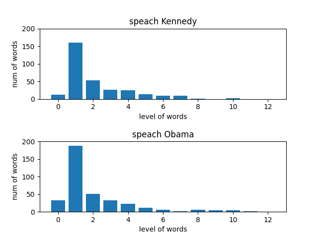

# make_word_level_graph

# How to run

```sh
wget https://www.cis.uni-muenchen.de/~schmid/tools/TreeTagger/data/tree-tagger-linux-3.2.2.tar.gz
wget https://www.cis.uni-muenchen.de/~schmid/tools/TreeTagger/data/tagger-scripts.tar.gz
wget https://www.cis.uni-muenchen.de/~schmid/tools/TreeTagger/data/install-tagger.sh
wget https://www.cis.uni-muenchen.de/~schmid/tools/TreeTagger/data/english.par.gz
sh install-tagger.sh
echo 'Hello world!' | cmd/tree-tagger-english

sudo apt install python3-pip
pip3 install treetaggerwrapper numpy matplotlib
python3 make_word_level_graph.py
```

# image


# Ref
https://qiita.com/3000manJPY/items/1c553a89b2c70edaa960
